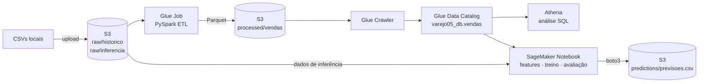
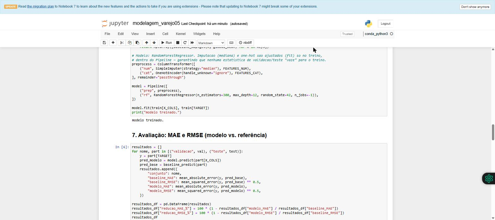
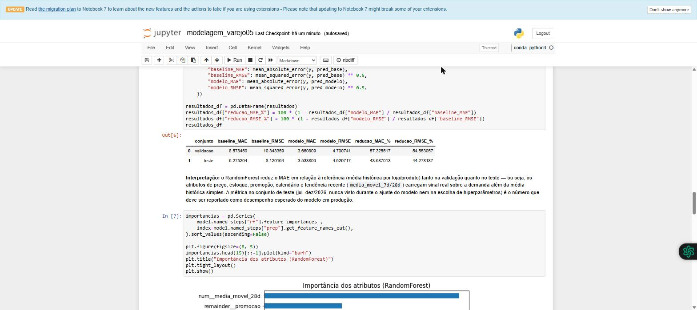

# Pipeline AWS de Big Data + Machine Learning — Previsão de Demanda no Varejo

Pipeline completo na AWS, da ingestão de dados brutos até a previsão de vendas: **S3 → Glue (PySpark) → Data Catalog → Athena → SageMaker → S3**.
O modelo prevê a quantidade vendida por **dia × loja × produto** para uma rede de varejo e reduz o erro médio em **44%** em relação à referência (baseline) no conjunto de teste.


-4479A1)

---

## Resumo

| | |
|---|---|
| **Problema** | Prever `quantidade_vendida` diária de 10 produtos em 4 lojas para janeiro/2027 |
| **Dados** | 44.278 registros históricos (2024–2026) em 3 CSVs, com problemas reais de qualidade, e 1.240 registros para inferência |
| **Infraestrutura** | AWS Academy Learner Lab (`us-east-1`), sem credenciais no código (IAM role `LabRole`) |
| **Modelo** | `RandomForestRegressor` em `Pipeline` do scikit-learn, com divisão temporal treino/validação/teste |
| **Resultado** | MAE **3,53** contra **6,28** do baseline no teste (**−44%**); RMSE **4,53** contra **8,13** (**−44%**) |

---

## Arquitetura



**Organização do bucket S3:** as camadas são separadas por prefixo. Os dados brutos nunca são sobrescritos.

| Prefixo | Conteúdo |
|---|---|
| `raw/historico/` | CSVs originais de 2024, 2025 e 2026 |
| `raw/inferencia/` | Arquivo de inferência (esquema diferente: sem a variável alvo) |
| `processed/vendas/` | Base consolidada e tratada, em Parquet (Snappy) |
| `predictions/` | Previsões finais geradas pelo modelo |
| `glue-scripts/` · `athena-results/` | Script do job e resultados das consultas |

---

## 1. Engenharia de dados — ETL com AWS Glue (PySpark)

O perfilamento dos 3 arquivos históricos encontrou os problemas abaixo, e todos foram tratados no job [`glue/etl_vendas_varejo05.py`](glue/etl_vendas_varejo05.py):

| Problema encontrado | Extensão | Tratamento |
|---|---|---|
| Datas em dois formatos misturados (`yyyy-MM-dd` e `dd/MM/yyyy`) | ~1,5% das linhas | Parsing dos dois formatos combinado com `coalesce` |
| `categoria` com formatação inconsistente e valores ausentes | ~19% das linhas | Reconstrução a partir de um dicionário `produto → categoria` derivado dos próprios dados |
| `preco` com valor sentinela inválido `-99.00` | 132 linhas | Convertido para nulo |
| `estoque` com valor sentinela `9999` (a faixa normal é 90–179) | 134 linhas | Convertido para nulo |
| `promocao` com valores misturados (`0/1/sim/nao`) | ~2,5 mil linhas | Padronizado para inteiro 0/1 |
| Linhas duplicadas exatas | 438 removidas | `dropDuplicates()` |

**Resultado:** 44.278 → **43.840 linhas** limpas. O job terminou com status `SUCCEEDED` (log conferido no CloudWatch), e a base foi catalogada automaticamente pelo Glue Crawler.

> **Decisão de projeto:** os valores ausentes que restaram (preço, estoque, temperatura) **não** foram imputados no Glue. A imputação acontece na modelagem e usa apenas estatísticas do conjunto de treino, para evitar vazamento de informação da validação e do teste.

## 2. Análise exploratória — Amazon Athena (SQL)

Seis consultas SQL ([`athena/queries.sql`](athena/queries.sql)) rodaram direto sobre o Data Catalog e também podem ser reexecutadas via boto3 ([`athena/run_queries.py`](athena/run_queries.py)). Principais achados:

- **Efeito da promoção:** a venda média sobe de **40,3** para **53,7** unidades por dia (**+33%**), um forte sinal preditivo.
- **Sazonalidade estável:** há pico em out–jan (~57–61 mil unidades/mês) e vale em abr–jun (~41–45 mil) nos três anos.
- **Diferença entre lojas:** a LOJA_04 vende ~42% mais que a LOJA_01.
- **Validação da limpeza:** 0 categorias nulas e 0 quantidades negativas na base tratada.

## 3. Modelagem — Amazon SageMaker

Notebook: [`sagemaker/modelagem_varejo05.ipynb`](sagemaker/modelagem_varejo05.ipynb), executado de ponta a ponta numa instância SageMaker Notebook.

**Features:**
- Numéricas: preço, estoque, temperatura prevista, médias móveis de 7 e 28 dias
- Categóricas: loja e produto (one-hot)
- Promoção
- Calendário: mês, dia da semana e fim de semana

**Prevenção de vazamento de dados (data leakage):**
- `receita_final` foi **excluída**, porque só é apurada ao fim do dia e não estaria disponível no momento da previsão.
- A divisão é **temporal**, e não aleatória: treino em 2024–2025, validação em jan–jun/2026 e teste em jul–dez/2026.
- A imputação (mediana e moda) é ajustada **só no treino**, dentro de um `Pipeline` com `ColumnTransformer`.
- `categoria` foi removida por ser redundante com `produto`.

### Resultados

| Conjunto | Baseline MAE | Baseline RMSE | **Modelo MAE** | **Modelo RMSE** | Redução do MAE |
|---|---|---|---|---|---|
| Validação | 8,58 | 10,34 | **3,66** | **4,70** | −57% |
| **Teste** (não usado no ajuste) | 6,28 | 8,13 | **3,53** | **4,53** | **−44%** |

O baseline é a média histórica de vendas por loja e produto, calculada no treino. Os atributos mais importantes foram a **média móvel de 28 dias** e a **promoção**.

<p align="center">
  
  
</p>

## 4. Inferência em lote

As 1.240 previsões de janeiro/2027 foram geradas com a mesma limpeza do ETL e as estatísticas do treino, e gravadas pelo próprio notebook em `s3://.../predictions/previsoes.csv` via boto3.
A saída foi validada: não há chaves duplicadas nem valores negativos, e a faixa prevista (26–77) é coerente com o histórico (4–84).
Arquivo: [`entrega_final/previsoes.csv`](entrega_final/previsoes.csv).

---

## Estrutura do repositório

```
├── glue/                  # Script PySpark do job de ETL
├── athena/                # Consultas SQL + runner em boto3 + print do console
├── sagemaker/             # Notebook de modelagem e inferência
├── relatorio/             # Relatório técnico completo
├── entrega_final/
│   ├── codigo/            # Cópia consolidada dos scripts entregues
│   ├── evidencias/        # Prints do SageMaker, status do Glue/S3 e saídas do Athena
│   └── previsoes.csv      # Previsões finais
├── pipeline_varejo05.drawio   # Diagrama da arquitetura
├── vendas_202{4,5,6}.csv      # Dados históricos (sintéticos)
└── dados_inferencia.csv       # Dados para previsão
```

## Como reproduzir

1. Crie um bucket S3 e envie os CSVs para `raw/historico/` e `raw/inferencia/`.
2. Crie um Glue Job (Spark) com `glue/etl_vendas_varejo05.py`, passando o parâmetro `--BUCKET <nome-do-bucket>`.
3. Crie um Glue Crawler apontando para `processed/vendas/` e para o database `varejo05_db`.
4. Rode as consultas de `athena/queries.sql` no Athena.
5. Abra `sagemaker/modelagem_varejo05.ipynb` em uma instância SageMaker e execute todas as células.
6. **Pare a instância do SageMaker** ao terminar, para evitar custos.

## Limitações e próximos passos

- As médias móveis ficam fixas durante o mês de inferência. Uma evolução seria a previsão recursiva, dia a dia.
- A inferência é em lote. O próximo passo seria publicar um *endpoint* no SageMaker ou orquestrar o pipeline com Step Functions.
- O modelo não generaliza para produtos fora do catálogo atual (10 SKUs).

---

## Autores

Projeto da Avaliação Multidisciplinar de **Infraestrutura de Big Data** e **Paradigmas e Tecnologias Emergentes**, do curso de Ciência de Dados (6º semestre) da FATEC.

- **Alexandre da Fonseca**: [GitHub](https://github.com/alefonsecabb)
- **Riquelmy Henrique Silva**

> Os dados são sintéticos e foram fornecidos pela disciplina.
